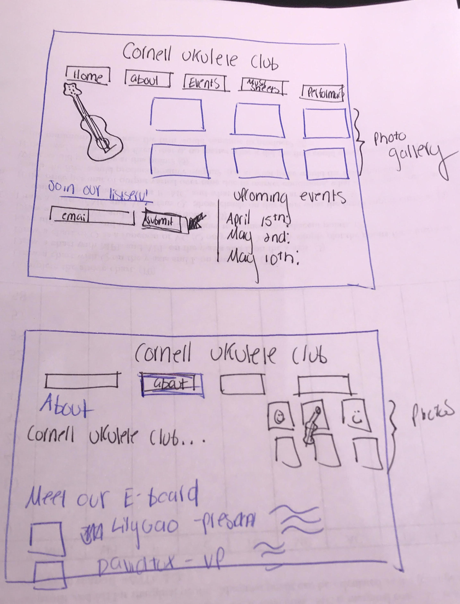
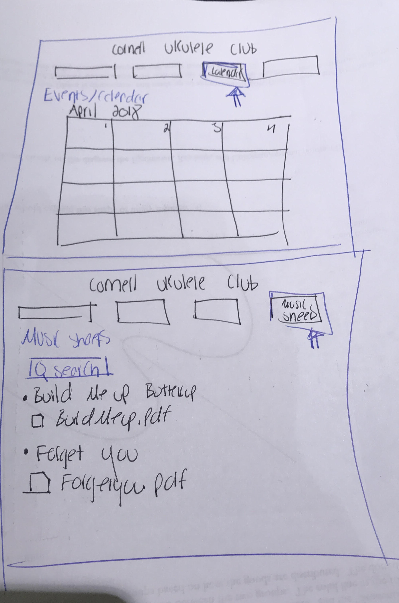
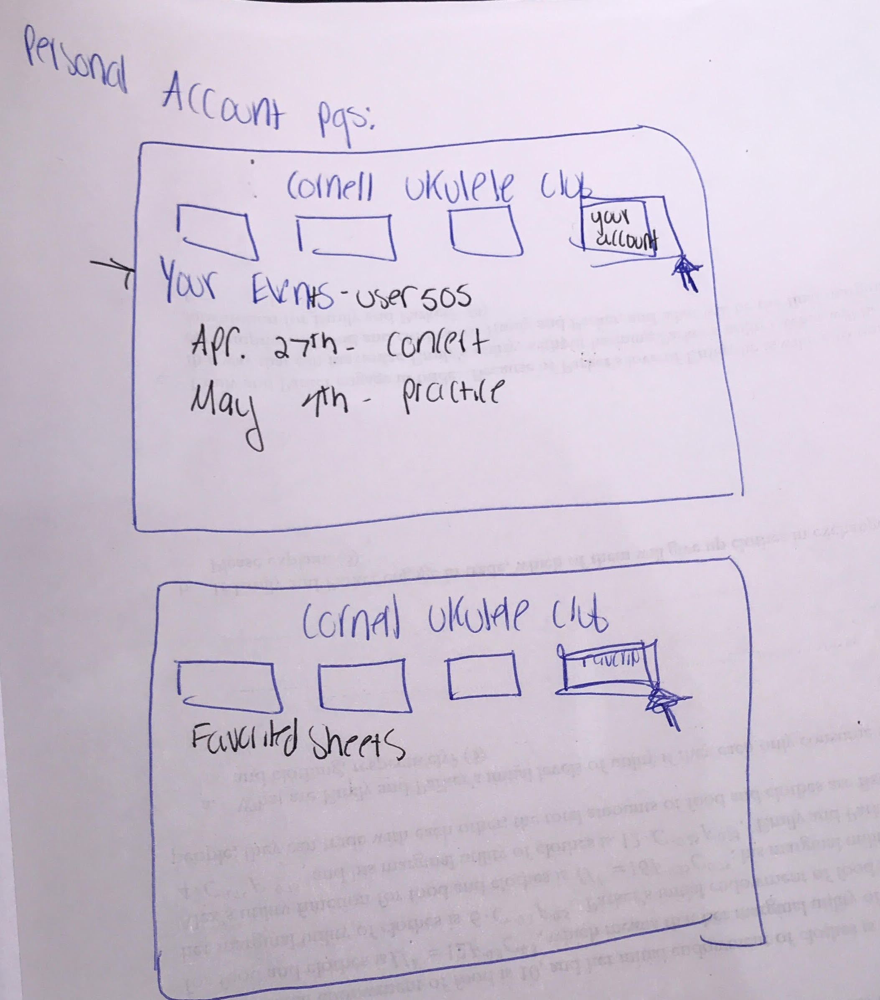
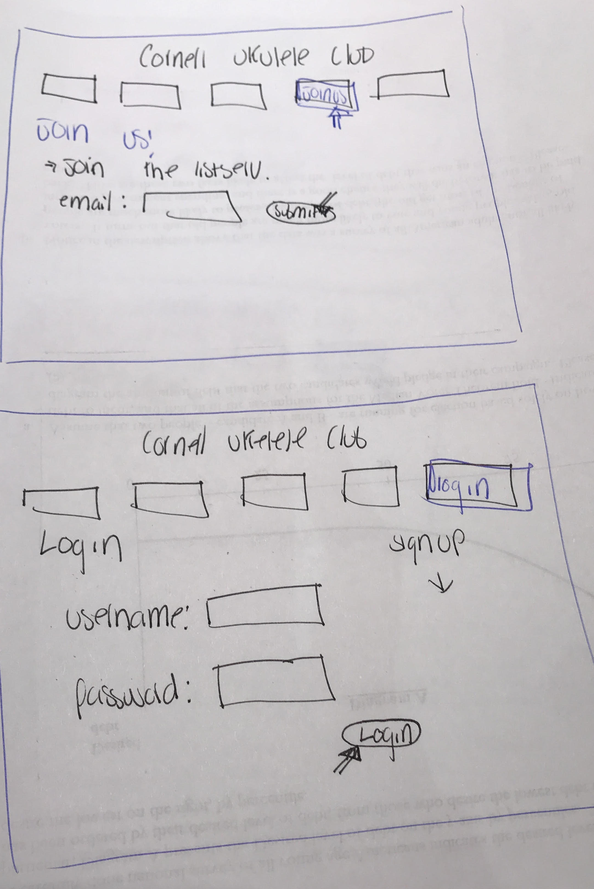

# Project 4 - Design & Plan

Your Team Name: silver-mammoth

## Milestone 1, Part II: Client Selection

### Client Description

Our client is the Ukulele Club at Cornell University. They want to make website for both members of the club and for visitors who are interested in the content that the club creates. They want people to view and edit event dates, music selection, and song requests.

## Milestone 1, Part III: Client Requirements

### Target Audience(s)

The potential audience for the ukulele club website is the members of the club and people are interested in their content. Members of the club can sign in, add music, and add events to the calendar. These members will only be able to do this if they are logged in. People who are interested in their content will be able to view events and music that the group has uploaded.

### Purpose & Content

The purpose of the website is to showcase the work of the ukulele club at Cornell University. There should be opportunity to view and upload new songs, view and upload events, and request songs for the club to perform at their next events.

### Needs and Wants

* **Needs/Wants #1**
  * **Needs and Wants** *(What does your client and audience need and want?)*
    * Client wants to there to be a log in and log out section for their members
  * **Design Ideas and Choices** *(How will you meet those needs and wants?)*
    * Create a log in and log out with seed data that matches that of the current members
  * **Memo** *(Justify your decisions; additional notes.)*
    * This is something they requested aside from our requirements for the project, either way we are happy to comply.

* **Needs/Wants #2**
  * **Needs and Wants**
    * They want to be able to add songs that they do to a list without changing the code
  * **Design Ideas and Choices**
    * Create a form for them to be able to add songs without changing the code themselves
  * **Memo**
    * Doing this will make it easier for them to upload their content because we know that coding can be complex

* **Needs/Wants #3**
  * **Needs and Wants**
    * They want to be able to add events without changing the code themselves.
  * **Design Ideas and Choices**
    * Create a form for them to be able to add songs without changing the code themselves.
  * **Memo**
    * Doing this will make it easier for them to upload their content because we know that coding can be complex

### Hosting Plan

We will not be hosting the client's website as part of this assignment and will let the client know that if they ultimately would like the website hosted, they will have to open a paid hosting account that supports PHP and MySQL.

### Client's Edits

**Yes**, the client will need the ability to edit the site after the end of the semester. The client will need to add more songs, members, and events. Our site fits the client's needs because we will have a login system that the admin can use to get access to forms that will allow them to delete and add new information securely. This way, they won't have to tinker with the code directly.

### Information Architecture, Content, and Navigation

[Lay out the plan for how you'll organize the site and which content will go where. Note any content (e.g., text, image) that you need to make/get from the client.]

[Note: As with the Needs and Wants table, there is no specific amount to write here. You simply need enough content to do the job.]

* **Content #1**
  * **Main Navigation** (List your site's navigation here.)
    * Home/About
    * Events/Calendar
    * Music Sheets
    * Log In
    * Log Out
  * **Sub-Categories** (List any sub-categories of under the main navigation.)
    * None
  * **Content** (List all the content corresponding to main navigation and sub-categories.)
    * *`Home`*: showcase a slideshow featuring photos taken during g-body meetings and past events that automatically scrolls (though users can also click the next and back arrows) and a form with an email input so people can join their listserv, as well as a box displaying the top three upcoming events. There will also be some basic information about the club - an abbreviated version of an About page.
    * *`Events/Calendar`*: features a calendar with the events, meetings, and performances that are upcoming. If the user is logged in, they will be able to click on a "Add" button to add an event to their personal event schedule. That will highlight the event for easy viewing.
    * *`Music Sheets`*: A table of all the music sheets used by the club, with columns for the title of the song, the artist, and a link to a pdf file with chords. There will also be a sidebar that allows users to search for the sheets they want, and a "Add" button on each entry that will allow a logged-in user to add that particular item to their personal Favorited Sheets list. There will also be a sidebar of a user's personally starred sheets.
    * *`Log In`*: A page with a form that allows users to input their usernames and passwords to log into the website. There will also be information on how a user can procure a username and password if they don't have one.
    * *`Log out`*: A page with form asking the user if they're sure they want to log out. If yes, then the page will redirect to the Home page.

### Interactivity

[What interactive features will your site have? What PHP elements will you include?]

[Much of this is up to you, however, implementing a login system is **required**. Logging in should not be required to view the site, however it must unlock extra functionality, e.g., admin functionality, comment posting, etc.]

[Also, describe how the interactivity connects with the needs of the clients/target audience.]

`Scrolling Image Gallery`: automatic scrolling images, accompanied by left and right arrows for users to skip through the images. (similar thing on the 'Past Performances' page)

`Calendar` *`(with 'Add Event' (+) button)`*: calendar view of all the client's events, likely going month-by-month; the user will be able to click through to see different months; if logged-in, events will include a (+) button that adds individual events to the `Your Events` list for that user's account.

`Music Sheets` *`(with 'Favorite Sheet' (+) button)`*: viewing page of *all* of the client's listed sheets of music; if logged-in, sheets will include a (+) button that adds individual sheets to the `Favorited Sheets` list for that user's account.

`Log In`: page with `username` and `password` fields and a 'login' button.

`Your Events`: events a user "adds" will be highlighted for easy viewing.

`Favorited Sheets`: side bar with the currently logged-in user's music sheets of interest, indicated by 'adding' the sheet from the `Music Sheets` page.

`PHP Includes:`
  - `header.php`: (possibly *navigation.php*) includes main navigation/club logo information and linkage.
  - `footer.php`: contact information
  - `init.php`: contains all main functions and other site-wide PHP information needed to complete the above interactivity functionalities.

### External Code

[What libraries (e.g. editor.js, jQuery Cookie, Image Sliders, jQuery) are you planning to use for the site? What do you have to do to incorporate those libraries? How much of your own code will satisfy the project requirements?]

- We used code from W3 Schools in order to create the slideshow. In order to give the users the best experience and satisfy the needs of our clients, this was the best way to present the photos on the home page. This gives the home page a place for users to interact and explore the photos, which hopefully interest them. This code was necessary in order to carry out the design we desired. The code is cited on the page. https://www.w3schools.com/howto/howto_js_slideshow.asp


We may find that we'd like a library to help us out with the Calendar view/functionalities, depending on the design we ultimately decide on. Additionally, we may want to use external JavaScript to enhance the User Experience on our site, aesthetically. Otherwise, we have not decided on implementing features that seem to necessitate external code, at the moment; our own code should foreseeably satisfy the project requirements!

### Scale

[How large will the site be (approximate number of pages) and how many hours of work will be required to complete it?]
`# of Pages:` approximately 5-8, but probably ~10+ pages total, including SQL, PHP Includes, etc.


## Milestone 1, Part IV: Work Distribution

[Describe how each of your responsibilities will be distributed among your group members.]

For each milestone we will divide the work evenly and make sure to distribute the designing and coding so that no one is doing all of one part. For each milestone, we will look at the work and group it into 5 separate pieces that everyone can choose from. If we feel that one person did mostly coding in the last milestone, they should have a less-coding heavy assignment on the next one. If anyone feels that their piece was far more work or far less work than everyone else's this will be addressed. Everyone will be required to push their work at least 2 hours before the 5pm deadline on Tuesday's so that we can figure out any questions and everyone has time to read over all of the work.

Work may change from week-to-week, but this is how it was distributed for M1:

`Grace`: Interactivity, External Code, and Scale (+ Team Contract)

`Jannie`: Hosting plan, client edits, information architecture/content/navigation, reaching out to client

`Tito`: Dividing the work, target audience, purpose, content, needs and wants

`Audrey`: Team Contract

`Marissa`: Work distribution


For future milestones, we will plan to have most work submitted at least one day before the deadline to sort out any issues. We will all work to organize meeting times/places. The dividing of the work is essential to progress on each milestone, which we will do at the meetings so that everyone's input is understood clearly.

## Milestone 1, Part V: Additional Comments

[If you feel like you haven't fully explained your design choices, or if you want to explain some other functions in your site (such as special design decisions that might not meet the final project requirements), you can use this space to justify your design choices or ask other questions about the project and process.]


## Milestone 2, Part I: PHP Interactivity

[Describe here what you plan to do for your PHP Interactivity requirement.]

`Adding an Event:`
- This feature will allow admin of the website to add to the events database.
- The PHP will involve processing and cleaning (filter_input) form input from the user, and inserting this cleaned data into the database. It will also involve checking if the user is currently logged in using the PHP sessions functions.
- This will consist of using the filter_input() function to filter incoming data, and the functions for opening access to the database

`Adding a new music sheets file:`
- This feature will allow admin of the website to the music sheets database
- The PHP will involve making sure the file was properly uploaded, and then will parse the file name and create a new one through using keys for the database. All of this stuff will then be inserted into the database.
- This will consist of using filter_input(), session() to make sure the user is logged in, and the function needed to open connection to a database using PHP.

`Login/Logout:`
- This feature will allow those with accounts to log in to the site and thus gain access to buttons that allow them to add events to their own personal to-do list and to "favorite" their favorite music sheets for easy access.
- The PHP will involve creating/deleting a session using session_start() or session_destroy(). This will be done after using a PHP function to connect to the database and then filtering the input entered by the user, and checking if it matches what's in the database. This is unnecessary in the case of logout.

`Favoriting a music sheet:`
- This feature will enable users to add a certain song on the song database to their own personal list for easy access.
- The PHP will involve adding a new entry to a database that joins database users with database music sheets.
- This can then be retrieved and rendered into HTML and displayed on the screen after filtering with htmlspecialchars().

`Adding an event to your personal list:`
- This feature will enable users to add an event to their own personal collection of events to go to.
- The PHP will involve adding an entry to a database that joins database users with database events.
- This can then be retrieved and rendered into HTML and displayed on the screen after filtering with htmlspecialchars().


## Milestone 2, Part II: Sketches, Navigation & Wireframes

### Sketches










### Navigation


* Home
* Calendar
* Music Sheets
* Log In
* Log Out (only displayed if the user is logged in)


### Wireframes


## Milestone 2, Part III: Evaluate your Design

We've selected **Patrick** as our persona.

We've selected Patrick as our persona because, as a team of 5 females, we think it is important, especially in this exercise, to be conscious of the unforeseen biases we may have put into our designs. Although it may be difficult for us to fully capture Patrick's reactions to the design, it will be an important first step into eliminating gender bias in our design if we continuously have this kind of a different perspective present in guiding our decisions.

### Tasks

`Task 1`: You are a Cornell undergraduate student who is looking for more fun concerts and performances around campus to check out! You've never seen a live ukulele performance, so you would like to see if attending a Cornell Ukulele Club performance would interest you by looking at some of their previous concerts!

  1. *starting at Home page*
  2. Click 'Past Performances' navigation link.
  3. Click *play button* to watch performance videos, until satisfied.


`Task 2`: You found that you would, in fact, be interested in attending one of the club's performances (if you are available). With the end of the semester drawing closer, the CUC may not have many performances left! Check to see if there are any upcoming performances that you could make it to. (If you think of multiple ways to complete this task, walk us through each of your ideas--there are multiple ways to do this one!)

  1. *starting at Home page*
  2. i) See: 'Upcoming Events' on Home page
  3. ii) See: '- Sat. April 28th. Concert'

  *~ALTERNATIVE~*
  2. i) Click 'Calendar' navigation link.
  3. ii) See: 'Concert - 7pm' on calendar on Saturday, 21 April (inconsistent--will be fixed).

`Task 3`: You are a *member* of the CUC and are logged-in to your account on the website. You have a performance coming up and need to retrieve the sheet music for your solo. The performance coordinator already used his administrative status on the site to add all of your assigned pieces' sheet music to your account's music sheet library. Find your sheets for your upcoming performance.

  1. *starting at Home page*
  2. Click 'Your Account' navigation link.
  3. Click 'Favorite Music Sheets' link.
  4. Browse 'Choose Music Sheet' dropdown list to select correct song.

### Cognitive Walkthrough

[Perform a cognitive walkthrough using the GenderMag method for all of your Tasks. Use the GenderMag template in the <documents/gendermag-template.md> file.]

#### Task 1 - Cognitive Walkthrough

[copy the GenderMag template here and conduct a cognitive walkthrough to evaluate your design (wireframes).]

[You may need to add additional subgoals and/or actions for each task.]

**Task name: Watch a Performance**

**Subgoal #1 : Select the 'Past Performances' link in the navigation bar**

  - Will Patrick have formed this sub-goal as a step to their overall goal?
    - Yes, maybe or no: `yes`
    - Why? (Especially consider Patrick's Motivations/Strategies.)
      Considering Patrick's information processing style of gathering as much information as possible before tackling a problem, we think that our navigation design will be effective for users like him. He would almost certainly look-over the navigation bar before making any clicks/decisions when going forward with this task, so he would see the tab that says 'Past Performances', and would likely be able to make that connection to attributing this action to part of the process to achieving the main goal of looking at previous concerts/performances by the CUC.

**Action #1 : Find+Click 'Past Performances' link**

  - Will Patrick know what to do at this step?
    - Yes, maybe or no: `yes`
    - Why? (Especially consider Patrick's Knowledge/Skills, Motivations/Strategies, Self-Efficacy and Tinkering.)
      For the same reasons as in Subgoal #1, Patrick would know that this is the point-of-interest for him making progress towards completing the goal/task. We think that because of Patrick's experience with computers as an accountant, he will have sufficient familiarity with basic constructs, especially the changing of a mouse cursor to a hand-picker selection icon when hovering over a linked element, that would generally lead the user to content referenced-by the linked element. Therefore, Patrick would know to *click* on the 'Past Performances' link to continue towards his goal.

  - If Patrick does the right thing, will he know that he did the right thing, and is making progress towards his goal?
    - Yes, maybe or no: `yes`
    - Why? (Especially consider Patrick's Self-Efficacy and Attitude toward Risk.)
      Depending on the final design details of the implementation of the website, Patrick may very easily notice that the link that he clicked to move to the (now-current) 'Past Performances' page is now bolded/formatted differently than the rest of the links in the navigation bar. Because of his medium computer self-efficacy, he would most likely assume that he was appropriately responsible for this change--as the content of the page below the navigation bar is relevant to the text of this same linked element.
      Otherwise, however, Patrick would almost definitely be able to identify that the gallery of content-boxes in the body of the page contain the content relevant to the link he just selected. In practice, the video-boxes would include a snapshot of the video content, which Patrick--who has some level of experience interacting with computers--would likely recognize--accompanied by the iconic `play` icon over the video box--as a reference to a video that he can choose to play.

**Subgoal #2 : Find a Performance Video to Watch**

  - Will Patrick have formed this sub-goal as a step to their overall goal?
    - Yes, maybe or no: `yes`
    - Why? (Especially consider Patrick's Motivations/Strategies.)
      Patrick is likely familiar-enough with computers that he could figure that the best way that a website would display performance content would be in video format, and given the gallery-view of the design of this page, it would likely be illogical for the videos to play automatically/without explicit selection, because the uniformity of the collection of video-boxes connotes a sort-of *menu* for selection. Additionally, this gallery format would be an effective means of displaying this content for Patrick because he is then able to look-over the collection before making his selection--accommodating his medium computer self-efficacy and risk-averseness by not playing a video unsolicitedly.


**Action #1 : Select a Performance Video (Find/Identify + Play)**

  - Will Patrick know what to do at this step?
    - Yes, maybe or no: `yes`
    - Why? (Especially consider Patrick's Knowledge/Skills, Motivations/Strategies, Self-Efficacy and Tinkering.)
      The `play` icons over the previews of the videos on this page should be familiar-enough to Patrick, because of his background experience with computers, that he should not have a problem working the technical aspects of playing one of the videos. However, I do think that users like Patrick who are number-driven and risk-averse would *greatly* appreciate either a filter/sort function that allows users to more-easily select their desired video, or we should include another piece of information, such as *view-count* of each individual video, to allow users to get a bit more information on the collection of videos to choose from, before selecting to spend their time watching any arbitrary video from the collection.

  - If Patrick does the right thing, will he know that he did the right thing, and is making progress towards his goal?
    - Yes, maybe or no: `yes`
    - Why? (Especially consider Patrick's Self-Efficacy and Attitude toward Risk.)
      With regards to the success of simply activating/playing a video, I think Patrick will not have a problem recognizing that after clicking the `play` icon, that there is now a video with sound playing, and that this is the performance video that he selected. With regards to the identification of whether-or-not this was the *ideal* video for him to have selected, I think that the above proposals of titles and popularity details/sorting would greater help him to quickly identify the correctness of his selection, as these features would offer him more data with which to be able to construct his judgement.


#### Task 2 - Cognitive Walkthrough

**Task name: Find a Future Performance to Possibly Attend**

**Subgoal #1 : Locate Upcoming Events**

  - Will Patrick have formed this sub-goal as a step to their overall goal?
    - Yes, maybe or no: `yes`
    - Why? (Especially consider Patrick's Motivations/Strategies.)
      He will probably figure that the site will list the most relevant (upcoming) events in a most-obvious location, so that they can be quickly accessed and referenced. This would be his first thought because he likes to first look for ways that new sites/technologies make his initial search experience as easy as possible, so that his motivation for accomplishing his goal is not discouraged.


**Action #1 : Identify the 'Upcoming Events' Section on the Home Page**

  - Will Patrick know what to do at this step?
    - Yes, maybe or no: `yes`
    - Why? (Especially consider Patrick's Knowledge/Skills, Motivations/Strategies, Self-Efficacy and Tinkering.)
      For similar reasons attributed to his motivations *above*, he would possibly be familiar-enough with websites that serve similar purposes to this one that he knows that dates/events are important pieces of information that are likely to be highlighted. The first place that he would look for *important* information would be the home page, since it would be somewhat *risky* to navigate away from the home page right away.

  - If Patrick does the right thing, will he know that he did the right thing, and is making progress towards his goal?
    - Yes, maybe or no: `yes`
    - Why? (Especially consider Patrick's Self-Efficacy and Attitude toward Risk.)
      Yes; finding the section entitled 'Upcoming Events' is definitely a good-enough clue that he would know that he has found the upcoming events, but perhaps he would want to get more information if he was not satisfied with those results!...


**(*somewhat optional*) Subgoal #2 : Look Elsewhere for *More* Event Listings**

  - Will Patrick have formed this sub-goal as a step to their overall goal?
    - Yes, maybe or no: `no`
    - Why? (Especially consider Patrick's Motivations/Strategies.)
      With no reference on the presumptive first-source of the list of upcoming events on the Home page, it is unlikely that Patrick would look much further to find more events if he was in no-way prompted to do so. If, at the end of the Home page list of events there was a link/reference to the 'Calendar' page, perhaps Patrick and other users would feel inclined to seek more information and options on upcoming events. (Discussed in the Cognitive Walkthrough Results.)


**Action #1 : Find(+Click) the 'Calendar' link in the Navigation Bar**

  - Will Patrick know what to do at this step?
    - Yes, maybe or no: `maybe`
    - Why? (Especially consider Patrick's Knowledge/Skills, Motivations/Strategies, Self-Efficacy and Tinkering.)
      If Patrick had already formed the subgoal to look further than the Home page for event information, he would likely look back to the familiar Navigation bar in the header and look for possibly relevant navigation links. If he did this, it would be most likely that he identify 'Calendar' as the place to look for upcoming events!
      Otherwise, however, it would be much more helpful to suggest/prompt this action *and* subgoal if a link (*as discussed in the CW Results*) were included on the Home page to lead users to this action.

  - If Patrick does the right thing, will he know that he did the right thing, and is making progress towards his goal?
    - Yes, maybe or no: `yes`
    - Why? (Especially consider Patrick's Self-Efficacy and Attitude toward Risk.)
      It would be generally assumed that, as a professional, Patrick is familiar with the concept of a calendar, and by identifying this term as a navigation link, he would have good promise of success in finding a listing of events. Once the link is clicked, the format of the 'Calendar' page would certainly resonate with Patrick as the proper location to find events.

**Action #2 : Look for Upcoming Events that Meet his Needs (e.g. a *concert*)**

  - Will Patrick know what to do at this step?
    - Yes, maybe or no: `yes`
    - Why? (Especially consider Patrick's Knowledge/Skills, Motivations/Strategies, Self-Efficacy and Tinkering.)
      Because of Patrick's information processing style of looking over his options before making decisions/taking risks, he would hopefully not be deterred by the proportion of front-heavy entries of 'practice' on the calendar, and he would continue through the entirety of the calendar to find the 'concert' entry in a later entry of the collection. (*possible implementation idea: color-code and/or filter events according to type*)


  - If Patrick does the right thing, will he know that he did the right thing, and is making progress towards his goal?
    - Yes, maybe or no: `yes`
    - Why? (Especially consider Patrick's Self-Efficacy and Attitude toward Risk.)
      If each calendar entry is implemented as a link to either a pop-up or page containing more information about the individual event, I think that Patrick would have plenty of information to support the completion of his goal to find a performance/concert event.


#### Task 3 - Cognitive Walkthrough

**Task name: Retrieve Sheet Music for your Upcoming Performance**

**Subgoal #1 : Locate your Account's Music Sheet Library**

  - Will Patrick have formed this sub-goal as a step to their overall goal?
    - Yes, maybe or no: `yes`
    - Why? (Especially consider Patrick's Motivations/Strategies.)
      The task as-written lets Patrick know that there exists some library of sheet music, specific to his account, that contains the information/content that he needs to complete the task, so since this information is not found directly from the Home page, this would definitely be a first-thought by Patrick in approaching this task.

**Action #1 : Click the 'Your Account' link in the Navigation Bar**

  - Will Patrick know what to do at this step?
    - Yes, maybe or no: `NO`
    - Why? (Especially consider Patrick's Knowledge/Skills, Motivations/Strategies, Self-Efficacy and Tinkering.)
      When looking that Navigation Bar, the first thing that Patrick would see with regards to the goal of this task would be the 'Music Sheets' link in the Nav. Bar, and I see no reason why any user would *not* do this. While the task *does* reference the user's account as a source for this content, the subject of the task is the Sheet Music, which by probably all reasonable users would be sought-out in the page that says 'Music Sheets'.

  - If Patrick does the right thing, will he know that he did the right thing, and is making progress towards his goal?
    - Yes, maybe or no: `maybe`
    - Why? (Especially consider Patrick's Self-Efficacy and Attitude toward Risk.)
      If, for whatever reason, the user made their way to the 'Your Account' page, they would be shown the 'Your Events' details/information by default; this would honestly *not necessarily* make it clear to the user that they are in any way approaching their Music Sheet Library, except that there is a fairly large link/button for 'Favorite Music Sheets', but it would probably be uncommon for users to feel like they are any closer to their goal just by looking at this page.

**Action #2 : Click the 'Favorite Music Sheets' link on the 'Your Account' page**

  - Will Patrick know what to do at this step?
    - Yes, maybe or no: `maybe`
    - Why? (Especially consider Patrick's Knowledge/Skills, Motivations/Strategies, Self-Efficacy and Tinkering.)
      If, for whatever reason, the user made their way to the 'Your Account' page, they would be shown the 'Your Events' details/information by default, and while his learning process here would perhaps lead him to tinker with the options on that page (if not initially deterred by the obviously irrelevant content initially shown in this tab), it would be safe to assume that a significant proportion of users would not complete this action as the task would initially suggest.
      Especially for users like Patrick who, when he "doesn’t think it will get him closer to what he wants to achieve, he will revert back to ways that he already knows will work", after making a judgement call on a page like this one, the following action here would probably be to go back to the Navigation Bar that helped them successfully complete Task #1, and would go to the 'Music Sheets' page, which, as of now (*which will absolutely be revised*), would *not* help him complete the task.

  - If Patrick does the right thing, will he know that he did the right thing, and is making progress towards his goal?
    - Yes, maybe or no: `maybe/yes`
    - Why? (Especially consider Patrick's Self-Efficacy and Attitude toward Risk.)
      While clicking this link would bring him to the correct location of the music library, it is not *necessarily* overtly-obvious that the user can switch/select from the *dropdown menu* the individual music sheet that is desired.

**Subgoal #2 : Select the Relevant Music Sheet from Your Music Sheet Library**

  - Will Patrick have formed this sub-goal as a step to their overall goal?
    - Yes, maybe or no: `yes`
    - Why? (Especially consider Patrick's Motivations/Strategies.)
      When looking at the 'Favorite Music Sheets' page, the user only sees a single sheet at a time, which may not lead them to recognize that there are more contents to their list/library than just the one default file shown.
      As an independent part of the overall goal, however, I think that Patrick *would* gather that in order to retrieve the correct sheet music for his solo performance, he would have to select a singular file from a (somewhat) larger collection of sheet music.


**Action #1 : Use the Dropdown Menu to Select an Individual Sheet**

  - Will Patrick know what to do at this step?
    - Yes, maybe or no: `maybe`
    - Why? (Especially consider Patrick's Knowledge/Skills, Motivations/Strategies, Self-Efficacy and Tinkering.)
      When looking at the 'Favorite Music Sheets' page, Patrick/the user only sees a single sheet at a time, which may not lead them to recognize that there are more contents to their list/library than just the one default file shown. Patrick could, however, identify the familiar dropdown element because of his information processing style leads him to look over all the present information before making a decision, but his aforementioned tendency to abandon decisions that do not immediately register as ones that will satisfy his goals may lead him to revert back to the 'Music Sheets' page to find the bigger list of sheet music that is sure t contain the file he's looking for. His thought process against forming this subgoal could include that perhaps his account could have only one favorite sheet at a time, and that he should just ask the performance coordinator which sheet to look for in the greater 'Music Sheets' collection.

  - If Patrick does the right thing, will he know that he did the right thing, and is making progress towards his goal?
    - Yes, maybe or no: `yes`
    - Why? (Especially consider Patrick's Self-Efficacy and Attitude toward Risk.)
      If Patrick does recognize the dropdown menu, he would see that there are (possibly) multiple sheet music files for him to consider, and by recognizing which of the songs/pieces are new to him, he could select that file to view. *However*, a possible obstacle to success here would be that, as discussed in the results of this walkthrough, there may not be sufficient information/details about each option in the dropdown menu for Patrick and other users to be able to identify their desired file(s); additionally, it is possible that the user/Patrick would think that the dropdown is just a way to navigate the contents of the individual file, as opposed to the library.


### Cognitive Walk-though Results

[Did you discover any issues with your design? What were they? How did you change your design to address the gender-inclusiveness bugs you discovered?]

[Your responses here should be very thorough and thoughtful.]
  - In `Task #1/Subgoal #1/Action #1`, I think that users would probably benefit from actual *text* titles above the videos on the 'Past Performances' page, so that users can quickly digest and skim-through the fairly uniform-looking content.
  - From `Task #1/Subgoal #2`, I do think that users like Patrick who are number-driven and risk-averse would *greatly* appreciate either a filter/sort function that allows users to more-easily select their desired video, or we should include another piece of information, such as *view-count* of each individual video, to allow users to get a bit more information on the collection of videos to choose from, before selecting to spend their time watching any arbitrary video from the collection.
  - From `Task #2/Subgoal #1+#2`, I do not think that Patrick and similar users would necessarily make the assumption that they should look further-into the website to find more events, so I think that we should implement an element in the 'Upcoming Events' section of the home page that also includes a link to the 'Calendar' page, perhaps by signaling to users that 'for more events, see our `Calendar`', or something to that effect.
  - From `Task #2/Subgoal #2/Action #2`, because the calendar is visible to all visitors of the website, if we were to implement the website such that all *members* of the club have user accounts, and/or that members of the *general public* do not have accounts (or different designations of accounts), the calendar/events may be more easily-digested by all visitors if the number of events on the calendar are limited to the *most relevant* entries for that visitor! Patrick, as an interested member of the general public, has little-to-no interest in seeing the details of the club's practice schedule, and could be confused or deterred by not being able to easily identify *general public* events that are actually relevant to him, instead of practices and rehearsals that are only relevant to club members.
  - From `Task #2/Subgoal #2`, I think that the 'Calendar' page should definitely include an obvious link to the 'My Events' page, so that this related content is accessed from this page. These pages are heavily associated, and therefore should allow for switching-between the two as easily as possible.
  - From `Task #3/Subgoal #1`, for similar reasons as the immediately previous bullet, the 'Music Sheets' page should certainly contain elements that show more connection/direction to the 'My Music Sheets' page, as it would be a common and understandable first-step for users looking for sheet music to first look to the general 'Music Sheets' page, especially since (when reading left-to-right) 'Music Sheets' seen far sooner than 'Your Account', it is probably safe to assume that almost any user would first go to 'Music Sheets' in `Task #3`. Possible implementations of this would include a visually-obvious button saying something like 'View your Music Sheets' when a user is logged-in, or an actual section on the 'Music Sheets' page that lists the user's personal library.
  - From `Task #3/Subgoal #2`, I think that the list of sheet music should be viewable as a more-detailed list than the simple dropdown menu that, presumably, only includes the title, filename, and/or composer of the music. The Music Sheet Library for the individual user's account should be viewable in a more digestable format.
    - Further, I think that the dropdown list is far too problematic to be used for this functionality (as described in the entire latter part of Task #3), and should not even be implemented; just make it into a information-rich list with all of the list's entries visible on the same page (perhaps not the full files, but a preview or an icon to accompany the text/numerical details of each entry).

## Milestone 2, Part IV: Database Plan

### Database Schema

[Describe the structure of your database. You may use words or a picture. A bulleted list is probably the simplest way to do this.]

Table: accounts
* field 1: id: primary key, unique, not null, auto increment, integer
* field 2: username: unique, not null, text
* field 3: password: not null, text
* field 4: session: unique

Table: events
* field 1: id: primary key, unique, not null, auto increment
* field 2: accounts_id: unique, not null, text
* field 3: events: unique, text

Table: practices
* field 1: id: integer, not null, primary key, auto increment, unique
* field 2: accounts_id: text
* field 3: practice: text, not null
* field 4: day: text, not null
* field 5: times: text, not null

Table: sheets
* field 1: id: primary key, unique, not null, auto increment
* field 2: filename: unique, not null, text
* field 3: title: text, not null
* field 4: artist: text

Table: accounts_sheets
* field 1: id: integer, not null, primary key, auto increment, unique
* field 2: account_id: text, not null
* field 3: sheet_id: text, not null


### Database Queries

[Plan your database queries. You may use natural language, pseudocode, or SQL.]
* $sql = "SELECT * FROM events"
* $sql = "SELECT * FROM sheets"
* $sql = "SELECT * FROM accounts WHERE session = :session_id;"
* $sql = "UPDATE accounts SET session = :session WHERE username = :username;"

## Milestone 2, Part V: Structure and Pseudocode

### Structure

[List the PHP files you will have. You will probably want to do this with a bulleted list.]

* index.php - main page.
* events.php - events page.
* musicsheets.php - music sheets page.
* login.php - login page.
* logout.php - logout page.
* includes/header.php - php include for the header and nav bar.
* includes/footer.php - php include for the footer.
* includes/init.php - php include for basic login/logout, etc. functionality

### Pseudocode

[For each PHP file, plan out your pseudocode. You probably want a subheading for each file.]

#### index.php

```
Pseudocode for index.php...

include init.php

include header.php

connect to database db
load in and format most recent 5-10 events using php to be outputted as html

include a JavaScript slideshow

include html form with action to same page (index.php) so users can join the listserv - the form will be processed with php to filter input, insert the input into database, or provide feedback telling the user that their input is in the wrong format  

include some basic information about the club, like e-board members - this will serve as a brief "about page" replacement, because we don't feel a full page is necessary

include footer.php
```

#### events.php

```
include init.php

include header.php

connect to database db

get data from the events and practices database to generate tables with practice and event dates and times

include a form that will allow admin to input new events as they come up

process the table to highlight things in yellow if the user has added them

include footer.php

```

#### musicsheets.php

```
include init.php

include header.php

insert php that will check if anything's been entered into the search bar, and if it has, it will filter the input and load in the appropriate information, which will be formatted into proper html for display with escaped output

connect to database
display search results

create a sidebar that will pull results from the accounts_sheets table and list all of the current user's favorite sheets

include footer.php

```

#### login.php

```
include init.php

include header.php

call functions in init.php if any inputs to the html form are submitted that will check if the info matches an existing user and if so, it will log them in and provide necessary feedback to the user and create a session

include an html form with text inputs for a username and password

include footer.php

```

#### logout.php

```
include init.php

include header.php

ask if user is sure they would like to log out

call function logout() in init.php and provide any feedback to the user, updating them on their login status

if the user is properly logged out, redirect to the home page

include footer.php

```

#### includes/header.php

```
include init.php

add an html page header, which will display the name of the website

cycle through the pages array from init.php to generate html displaying the navigation bar

```

#### includes/footer.php

```
add html creating a footer with the club name in it

```

#### includes/init.php

```
add an array of all webpages
add a variable keeping track of the current page

add methods for opening databases

add methods for login and logout  

```

## Milestone 2, Part VI: Additional Comments

[Add any additional comments you have here.]


## Milestone 3: Updates

[If you make any changes to your plan or design, make a list of the changes here.]
* We got rid of the About page and the Your Account, Your Events, and Favorite Sheets pages. Based on the cognitive walkthrough, we decided that that formatting was unintuitive for the user, and it's better to just include that information on the page they would usually go on for sheets or events in the form of a sidebar.


## Milestone 4: Updates

[If you make any changes to your plan or design based on your peers' feedback, make a list of the changes here.]


## Milestone 5: Cognitive Walkthrough


## Task 1 - Cognitive Walkthrough

**Task name: Add an event to the calendar**


**Subgoal #1  : log in as a user**

  - Will Patricia have formed this sub-goal as a step to their overall goal?
    - Yes, maybe or no: 'maybe'
    - Why? (Especially consider Patricia's Motivations/Strategies.)
      It might not be clear to new visitors to the site that they cannot add events to the calendar unless they are logged in as a user. Considering Patricia's motivations and attitudes, she would likely infer from past experiences with websites that a performing a function like this would require membership in the club, and thus she would need to be logged in as a user. She also gathers information before trying to solve a problem, therefore she would conclude that logging in is a necessary stop in order to complete the task.


**Action #1 : Find+click 'log in' tab**


  - Will Patricia know what to do at this step?
    - Yes, maybe or no: 'yes'
    - Why? (Especially consider Patricia's Knowledge/Skills, Motivations/Strategies, Self-Efficacy and Tinkering.)
      Similar to the reasons laid out in subgoal 1, Patricia would conclude from past experience and some understanding of the site that she must be logged in in order to add events to the calendar. Due to her reliance on familiarity with past experiences, the website design fits what she is likely used to doing/seeing.

  - If Patricia does the right thing, will she know that she did the right thing, and is making progress towards her goal?
    - Yes, maybe or no: 'yes'
    - Why? (Especially consider Patricia's Self-Efficacy and Attitude toward Risk.)
        When Patricia finds and clicks on the 'log in' tab, the page will load with the 'log in' header and two boxes; one for her username and one for her password. Patricia likes performing tasks with familiar features, which is true of this task. She also has medium self-efficacy when performing unfamiliar tasks, so she is highly motivated to complete the tasks she has set out to do, even if they seem a bit challenging. This task, however, is very familiar to many other website logins, and should not be challenging for Patricia to figure out.


**Subgoal # 2: Add event to the calendar**

- Will Patricia have formed this sub-goal as a step to their overall goal?
    - Yes, maybe or no: 'yes'
    - Why? (Especially consider [persona name]'s Motivations/Strategies.)
Patricia's reliance on familiarity will serve her well in forming this sub-goal in order to update the calendar because this form is very similar to the login form and many other methods of submission on other sites. The form is the only place where a user could enter information on this page, and it would be a logical for Patricia to conclude this is the page to add to the calendar. She does not have to tinker much to form this subgoal, which aligns with her persona.


**Action # 2 : Click on the calendar page, find the entry boxes and enter event date and upload to site**


- Will Patricia know what to do at this step?
    - Yes, maybe or no: 'yes'
- Why? (Especially consider Patricia's Knowledge/Skills, Motivations/Strategies, Self-Efficacy and Tinkering.)
  Patricia will know what to do here because the 'calendar' page would be found by her either tinkering with the site or she would find it because previous experience would lead her to believe this is where to upload an event.


  - If Patricia does the right thing, will she know that she did the right thing, and is making progress towards her goal?
  - Yes, maybe or no: 'yes'
  - Why? (Especially consider Patricia's Self-Efficacy and Attitude toward Risk.)
  Patricia's  experience with numbers would and her information-gathering strategy would allow her to easily find the form entry boxes. The calendar should be familiar to many online calendars she has seen before, so it should not be confusing to how the information will be posted once she submits her event. The boxes clearly show where event, date and time should be entered, and especially with a bit of tinkering, Patricia would quickly figure out how to add an event.


**Task #2: Join email list **


**Subgoal # 1 : Find an email address, phone number or contact info for the Ukele club**

    - Will [persona name] have formed this sub-goal as a step to their overall goal?
      - Yes, maybe or no: 'yes'
      - Why? (Especially consider Patricia's Motivations/Strategies.)
Patricia would likely thought of this sub-goal as a step to joining the email list because she learns new technology by tinkering, trying out new features, and familiarizing herself with it. If she is an interested individual, not already in the Ukele club, but looking for more information, Patricia would purposefully look around the site, and likely begin with the home page.


**Action # 1: Click on the email link**


- Will Patricia know what to do at this step?
  - Yes, maybe or no: 'yes'
  - Why? (Especially consider Patrica's Knowledge/Skills, Motivations/Strategies, Self-Efficacy and Tinkering.)
    It is likely that Patricia will scan the home page for information and the email link will stand out to her. She relies on familiarity and previous experiences, which would guide her eyes to the link and follow the directions to join the list-serv.

- If [persona name] does the right thing, will she know that she did the right thing, and is making progress towards her goal?
  - Yes, maybe or no: 'yes'
  - Why? (Especially consider Patricia's Self-Efficacy and Attitude toward Risk.)
When clicking on the email link, this will open an email on her computer, where she can follow the directions to join the list-serv given on the site. When this comes up, there will be no question that Patricia performed the correct action. Patricia approaches risks by trying new features, so she might not expect this click to lead her to her sub-goal, but it will be apparent that she reached her goal.


### Cognitive Walk-though Results

[Did you discover any issues with your design? What were they? How did you change your design to address the gender-inclusiveness bugs you discovered?]

[Your responses here should be very thorough and thoughtful.]

- From `Task #1/subgoal #1/Action #1`, I think it is clear where to log in, as our design plain was to keep things very simple. It might not be clear that logging in should be a subgoal in order to add an event to the calendar, although Patricia would be able to tinker around and discover this. We chose to indicate to the users on the calendar page that they must be logged in to add events so that less tinkering would be required. It's also important for non-users to understand that they cannot add events.

- In `Task #1/Subgoal #2`, the 'add event' heading is very clear, and sits above the calendar so that it is one of the first things the user can see. There were no issues with this design, except we enlarged the add event form because it was an important funciton that we did not want users to miss.

- For `Task #1/Subgoal #2`, it is important that the boxes for adding events are labeled because the layout now might cause some confusion. Although it is obvious that you can't enter an 'event name' in the date box, we changed the design so that each box clearly states what should be entered.

- For `Task #2/Subgoal #1`, I think many people would search for any way to contact the Ukelele club when looking to get more information. It is a logical step for not only Patricia's persona, but most users to try to find out how to contact a club.

- For `Task #2/Subgoal #1/action #1`, The link to join the listserv stands out from the other, not underlined text, and is clear to our persona and most users. Although it is difficult to assume the persona of non-Ukelele club members, as anyone could visit the site, we can assume the persona of many interested Ukelele students. The listserv section clearly lays out the steps to take in order to join the listserv and the link conveniently opens a visitors email.


## Milestone 5: Final Notes to the Clients

[Describe in some detail what the client will do (or would have to do) in order to make this website go live. What is the deployment plan?]

The client said that they will have to run the website by their faculty advisor before they can deploy the site. However, if the client wanted to make the website live immediately, they would use Heroku. They would need to redirect index.php to index.html. Then, they would use git to create a version of the website that they want to make live. They would do this by running the command git init, git add. Next, they would want to commit all changes and create their site on Heroku by doing "heroku apps:create CornellUniversityUkuleleClub". Finally, they would deploy their site using git.

[Include any other information that your client needs to know about your final website design. For example, what client wants or needs were unable to be realized in your final product? Why were you unable to meet those wants/needs?]

Everything that we needed to do for the final website design lined up with what the client wanted or needed.

## Milestone 5: Final Notes to the Graders

[1. Give us three specific strengths of your site that sets it apart from the previous website of the client (if applicable) and/or from other websites. Think of this as your chance to argue for the things you did really well.]

Our three specific strengths are:
- Our website has more user interactivity, allowing the users to be more engaged while using our website, potentially increasing their affinity towards CUC.
- Our website allows users to sign in, differentiating between admins and regular users. The two types of users have different capabilities in terms of editing the website's content. Admins can use to get access to forms that will allow them to delete and add new information securely, while normal users can't. This helps differentiate between members and potential members of the club.
- Our website styling is minimalistic, which adheres to the client's needs in focusing on the content. Going off of that, the calendar and music sheets pages provide much detailed information on club event and activities. The music sheets are also expandable, which is extremely user friendly for people who are actually interested in learning the different pieces.

[2. Tell us about things that don't work, what you wanted to implement, or what you would do if you keep working with the client in the future. Give justifications.]

Some stuff that we didn't really implement, but would love to implement in the future (if we have the opportunity with the client again), is to add a contact us page that allows users to send inquiries directly to the club or their specific members. We didn't do it this time because of timing constraints, and we think that other parts of the website were more important since it is the foundation of the page.

[3. Tell us anything else you need us to know for when we're looking at the project.]

We think that having an admin for our website is very user friendly and reasonable, which in our opinion adds a lot to our project and the functionality of it. Have fun exploring our project! We all put in a lot of work into constructing it, and hope that you and our client enjoys it.
